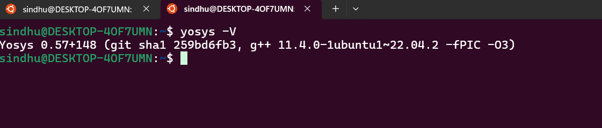
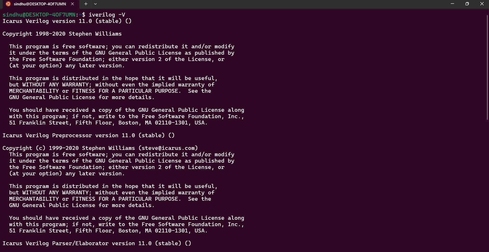
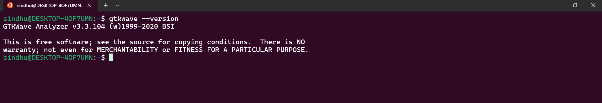
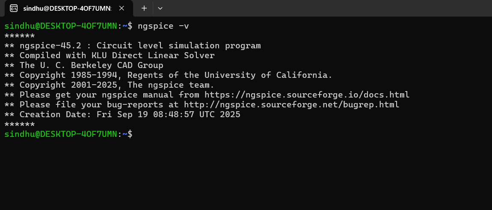
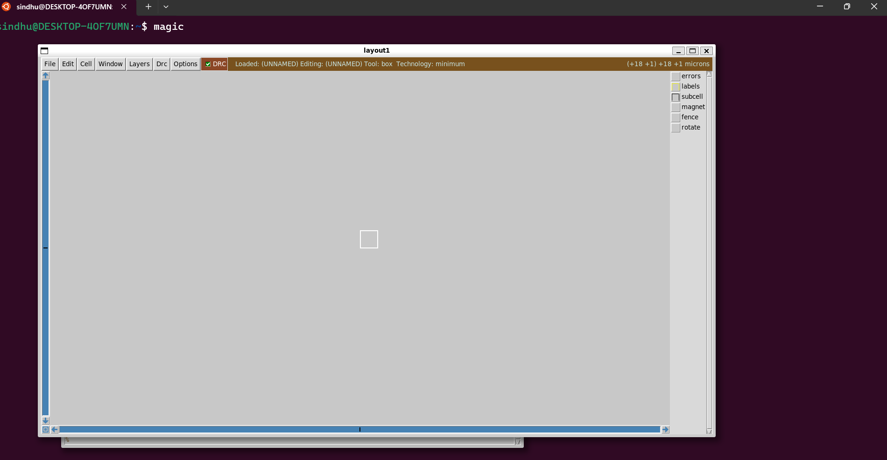
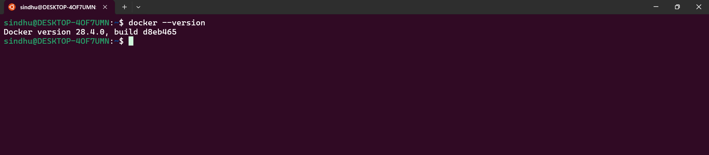
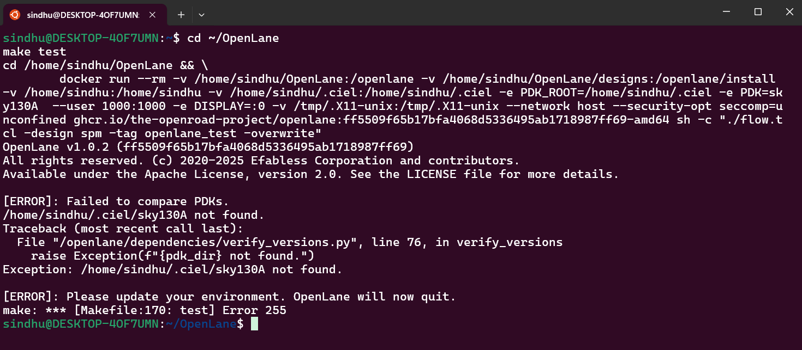
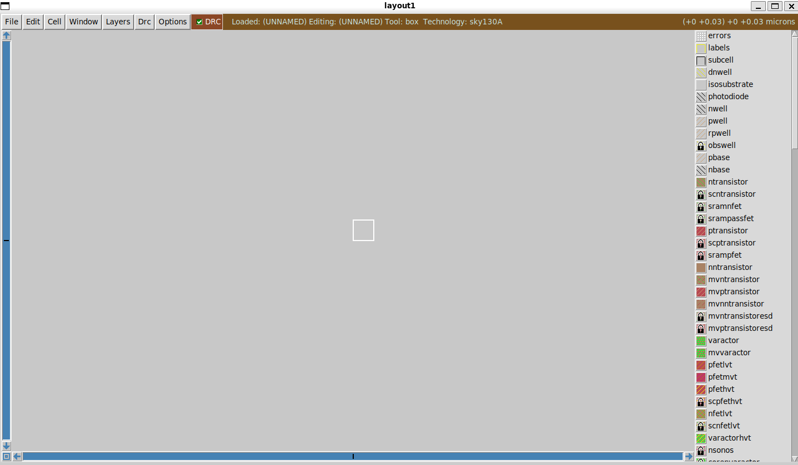

# 🛠️ Task-2: Tool & PDK Installation Proof  

All tools have been successfully installed and verified.  

---

## 🔹 Yosys  
  

---

## 🔹 Icarus Verilog  
  

---

## 🔹 GTKWave  
  

---

## 🔹 ngspice  
  

---

## 🔹 Magic  
  

---

## 🔹 Docker  
  

---

## 🔹 OpenLane  
  

---

## 🔹 SkyWater PDK (sky130A)  
  
