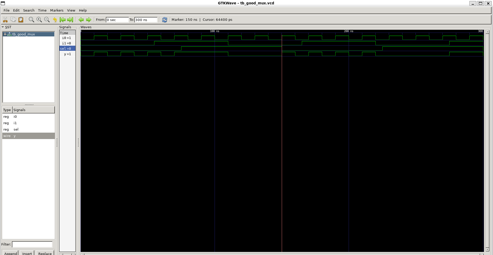
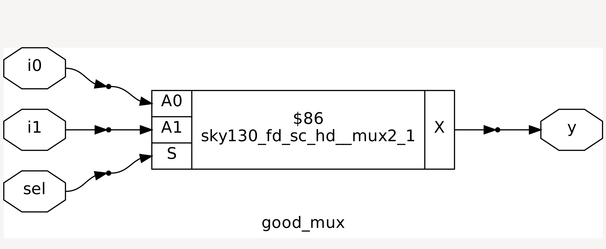
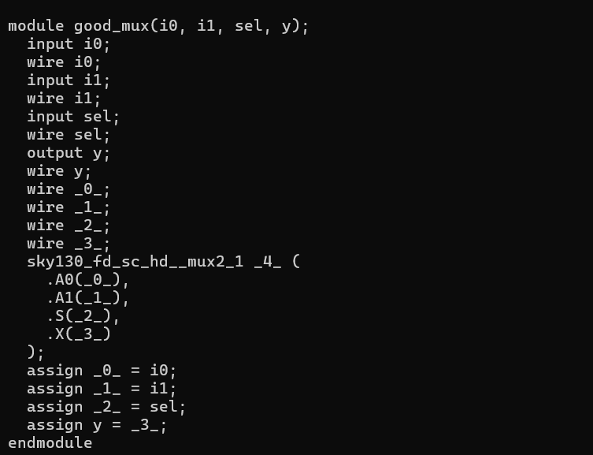

#  Day-1 – Simulation & Synthesis Basics


---

## ✨ What I Learnt Today

<span style="color:#A3C4F3;">**Simulator and how it works**</span>

* Simulator ensures **RTL adheres to spec** (e.g., *Icarus Verilog – iverilog*).
* **Design** → set of Verilog codes.
* **Testbench (TB)** → provides **stimulus (test vectors)**.
* Simulator generates a **VCD (Value Change Dump)** file → viewed in **GTKWave**.
* On every **input change**, outputs are re-evaluated.

---

## 📊 Simulation Flow

1. **Stimulus Generator** → sends primary inputs to design.
2. **Design (Verilog RTL)** → produces primary outputs.
3. **Stimulus Observer** → checks outputs and verifies correctness.
4. **VCD file** → viewed with GTKWave.


---

## 🛠️ From Simulation to Synthesis

<span style="color:#FBC4AB;">**RTL → Gate-Level Netlist**</span>

* RTL (behavioral spec) is converted to a **netlist** using standard cells.
* **Inputs to synthesizer (yosys)**:

  * `design.v` (Verilog RTL)
  * `.lib` (collection of standard cells, multiple “flavors”)

### Why multiple cell flavors?

1. **Combinational delay** impacts max clock speed:

   ```
   Tclk > Tcritical + Tcomb + Tsetup
   ```
2. **Hold checks** need slower cells:

   ```
   Thold < Tcritical + Tcomb
   ```
3. **Cell speed** depends on transistor width & capacitance charging:

   * Wide → fast (low delay, high area & power).
   * Narrow → slow (higher delay, less power/area).

👉 Hence, **cell selection plays a crucial role in synthesis and it is given as input to the synthesizer along with constraints**.

---

## 🧪 Lab Work

```diff
+ Step 1: Good MUX Simulation
```

*  Verilog for `good_mux` and its TB.
* Compiled & simulated using:

  ```bash
  iverilog good_mux.v tb_good_mux.v
  ./a
  ```
* Generated VCD and viewed in GTKWave:

  ```bash
  gtkwave tb_good_mux.vcd
  ```

```diff
+ Step 2: Synthesis with Yosys
```

* Commands:

  ```bash
  read_liberty -lib <path/to/libfile>
  read_verilog <filename.v>
  synth -top <modulename>
  abc -liberty <path/to/libfile>
  show
  ```
* Netlist export:

  ```bash
  write_verilog <filename_netlist.v>
  write_verilog -noattr <clean_netlist.v>
  ```

---

## DAY_1 work

## 📸 Lab Results

### 🔹 GTKWave Output



### 🔹 Good MUX (Graphical Version)


### 🔹 Netlist



