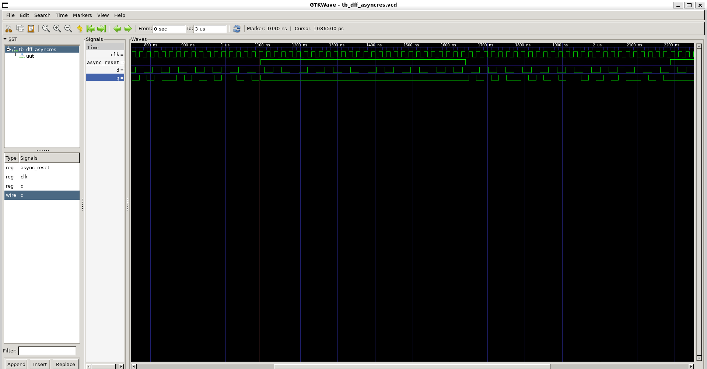
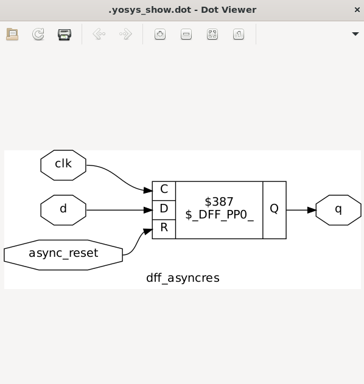
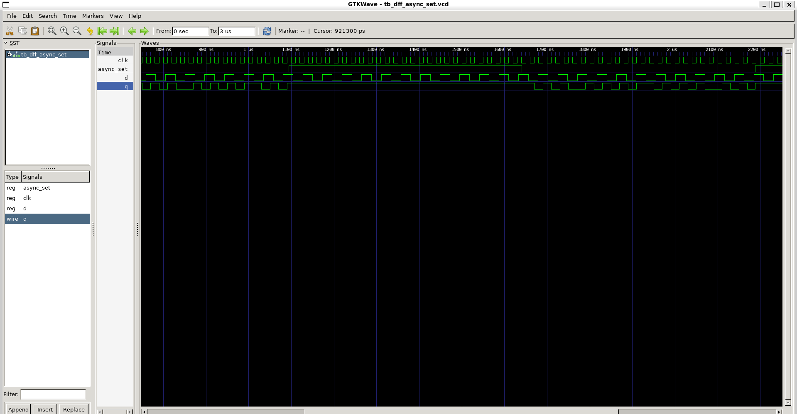
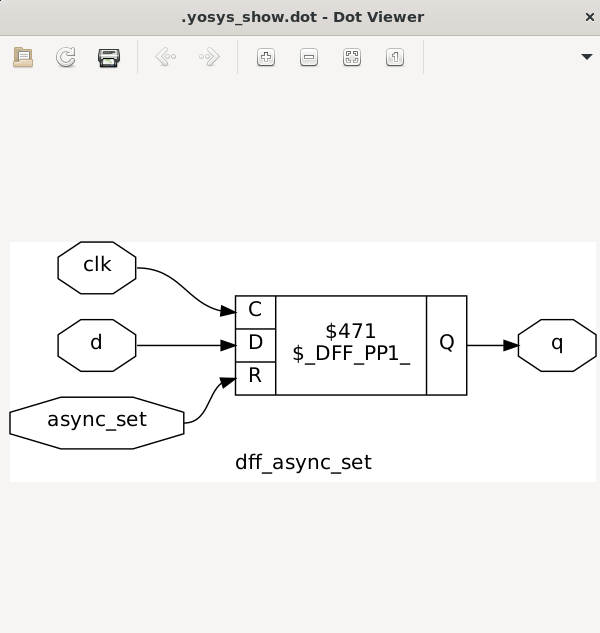
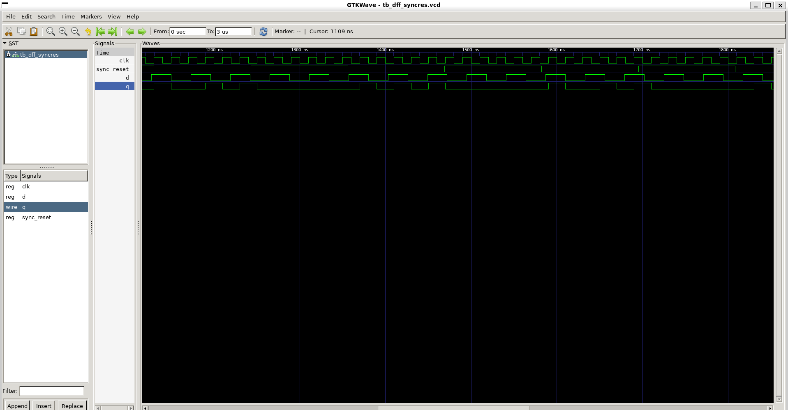
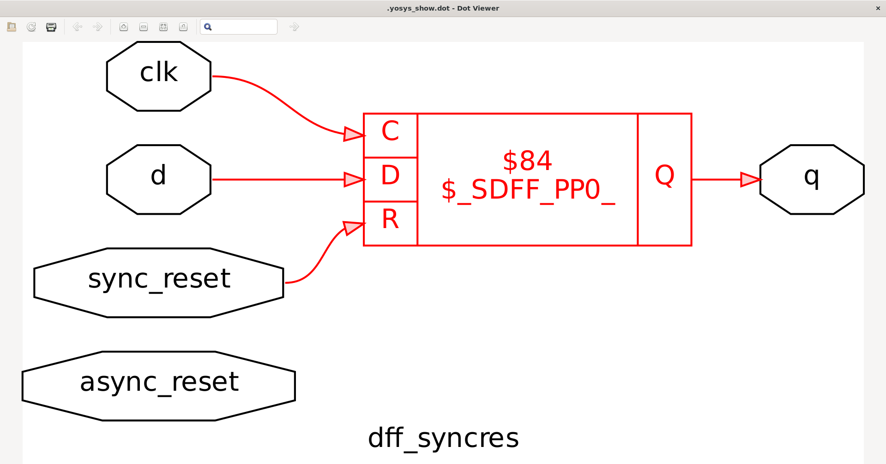
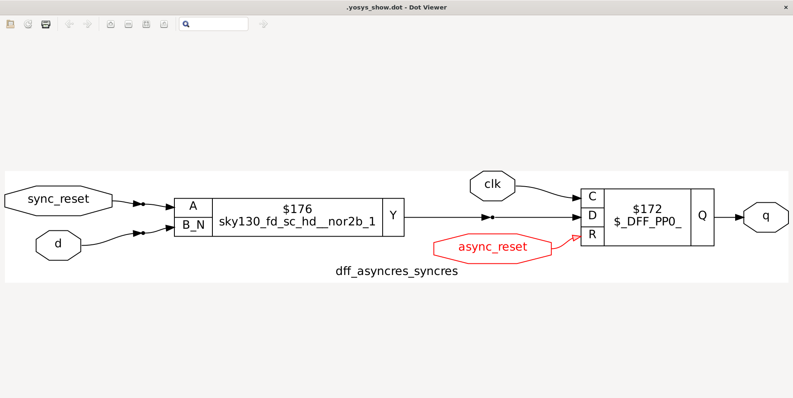

# Various Flops and Flop Coding Styles

## Why Flops?

* In digital circuits, **combinational logic** can create **glitches** due to **propagation delays**.
* To avoid glitches and ensure stable outputs, we use **Flip-Flops (Flops)**, which are **edge-triggered storage elements**.
* Flops capture data only on the **clock edge**, thus filtering out intermediate glitches.

---

## 1. Positive-edge DFF with Asynchronous Reset

```verilog
always @(posedge clk or posedge areset) begin
  if (areset)
    q <= 1'b0;
  else
    q <= d;
end
```

**Behavior:**

* `areset=1` → output `q=0` **immediately** (no clock required).
* On each posedge of `clk` (when `areset=0`), `q` takes value of `d`.

**Diagrams:**

* Simulation → 
* Synthesis → 

---

## 2. Positive-edge DFF with Asynchronous Set

```verilog
always @(posedge clk or posedge aset) begin
  if (aset)
    q <= 1'b1;
  else
    q <= d;
end
```

**Behavior:**

* `aset=1` → output `q=1` **immediately** (independent of clock).
* On posedge of `clk` when `aset=0`, flop captures `d`.

**Diagrams:**

* Simulation → 
* Synthesis → 

---
## 3. Positive-edge DFF with Synchronous Reset

```verilog
always @(posedge clk) begin
  if (sreset)
    q <= 1'b0;
  else
    q <= d;
end
```

**Behavior:**

* `sreset=1` → output becomes `0` **only on clock edge**.
* If `sreset=0`, normal DFF behavior (`q=d`).

**Diagrams:**

* Simulation → 
* Synthesis → 


---

## 4. Positive-edge DFF with Asynchronous Reset + Synchronous Reset

```verilog
always @(posedge clk or posedge areset) begin
  if (areset)
    q <= 1'b0;
  else if (srset)
    q <= 1'b0;
  else
    q <= d;
end
```

**Behavior:**

* `areset=1` → clears output to `0` immediately.
* Otherwise, on posedge `clk`:

  * if `srset=0` → output `q=0`
  * else → `q=d`
* Note: Async reset + sync reset combo can lead to **toggling issues** if not prioritized properly.

**Diagrams:**

* Simulation → 
* Synthesis → 

---


