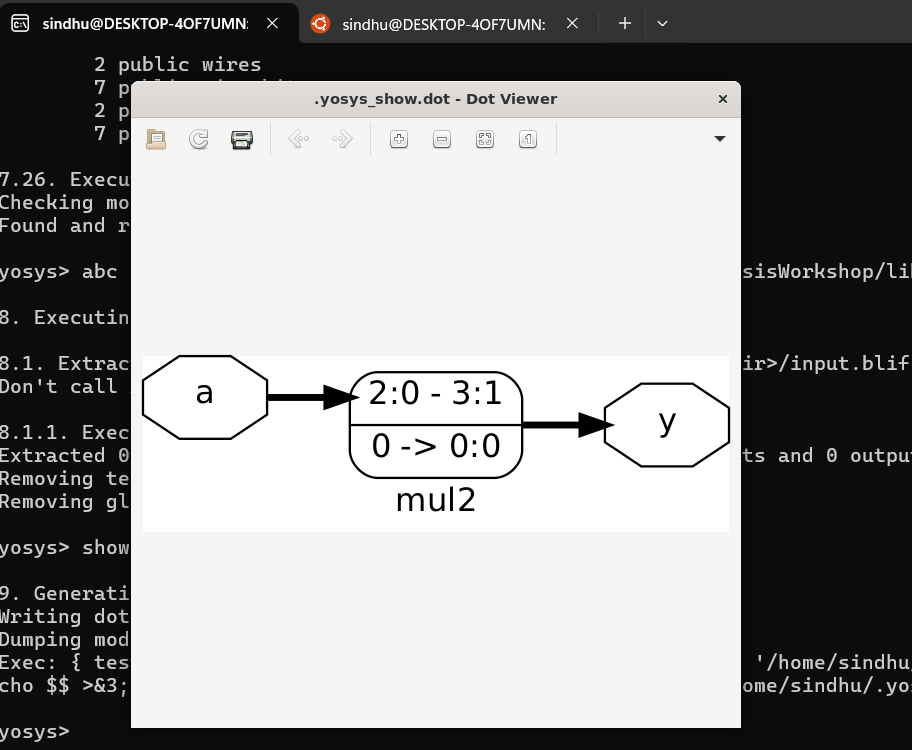
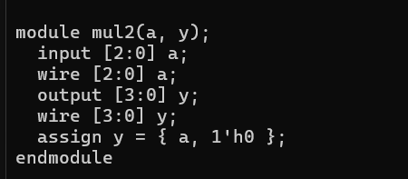
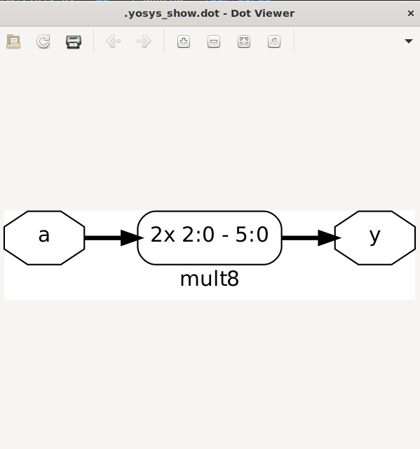
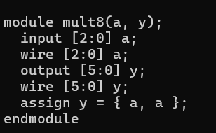

# 🎯 Interesting Optimizations in Multiplication

In digital design, multiplication by specific constants can often be implemented **without a dedicated multiplier circuit**.
Synthesis tools recognize these cases and replace them with **simpler wiring**, which saves **area, power, and delay**.

---

## ✅ Trick 1 – Multiplication by Powers of Two

**Case 1:**

* Example: ( y = 2 \times a )

  * If ( y ) is 4-bit and ( a ) is 3-bit → simply **append one `0`** to the bits of ( a ).
  * No arithmetic unit is used.

* Generalization:

  * Multiply by **4** → append **two zeros**
  * Multiply by **8** → append **three zeros**
  * Multiply by **16** → append **four zeros**

This works because powers of two correspond to **binary shifts**, which hardware realizes as **direct wiring with zeros**.

---

## ✅ Trick 2 – Multiplication by Composite Constants

**Case 2:**

* Example: ( y = a \times 9 )
* Since ( 9 = 8 + 1 ):

  * Multiply by 8 → ( y = a000 ) (append three zeros)
  * Multiply by 1 → ( y = a )
  * Combine both results → ( y = (a000 + a) )

In many designs this simplifies to **concatenating `a` with itself** → ( y = aa ).

---

## 🔎 Key Takeaways

* Multiplication by **powers of two** = **concatenation with zeros** (zero cost).
* Multiplication by **non-powers** = **break into sum of simpler terms** 
* Optimizations reduce:

  * 🔹 **Area** (fewer gates)
  * 🔹 **Power** (less switching)
  * 🔹 **Delay** (shorter critical paths)
* These optimizations are automatically applied by synthesis, but understanding them helps in **writing efficient RTL**.

| Constant | Optimized Form | Hardware         |
| -------- | -------------- | ---------------- |
| 2        | `a << 1`       | Wiring           |
| 4        | `a << 2`       | Wiring           |
| 8        | `a << 3`       | Wiring           |
| 9        | `(a << 3) + a` | 1 adder + wiring |
