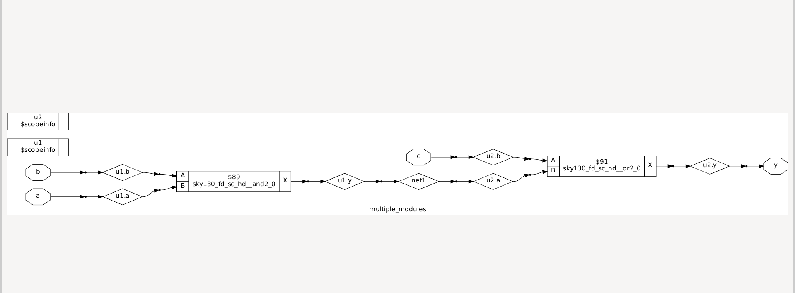
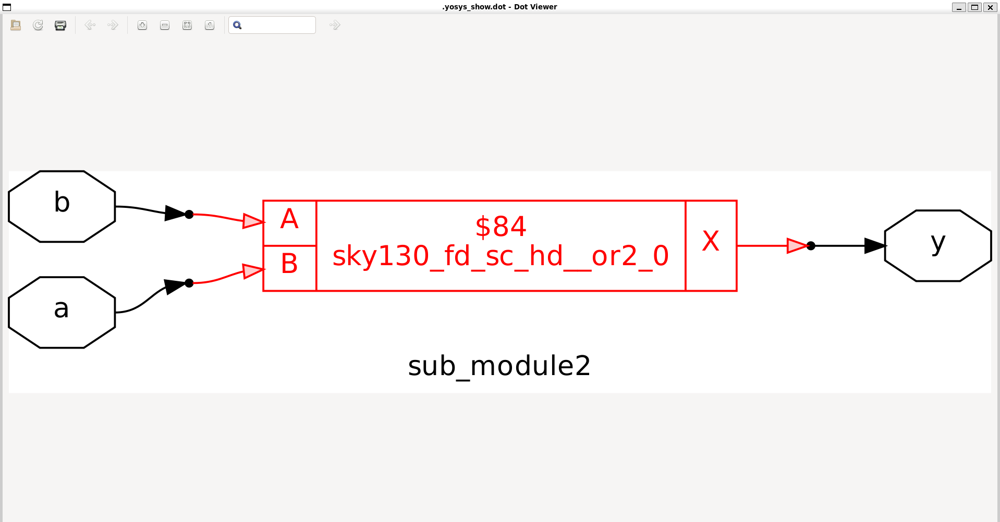

# Hierarchical vs Flattened Synthesis


---

##  1. Hierarchical Synthesis

* **Keeps the design modular** – each submodule synthesized separately.
* Good for **divide and conquer** and **reusability**.
* Important point:

  > **Stacking PMOS is bad** – since PMOS has lower mobility, stacking increases delay.
  > To compensate, width must be increased → costs **area & power**.
  > Therefore, instead of implementing `OR` directly, it’s often better to use a `NAND` + inverters.


---

## ✨ 2. Flattened Synthesis

* Hierarchy is **removed** and design is treated as **one big module**.
* Command in Yosys:

```bash
flatten <filename.v>
```

* Easier for optimization but harder for debugging.



## ✨ 3. Submodule-Level Synthesis

* Useful when we have **multiple instances of the same module**.
* Instead of synthesizing the whole design repeatedly, each submodule is synthesized once and then **reused**.
* Improves synthesis runtime and consistency.




