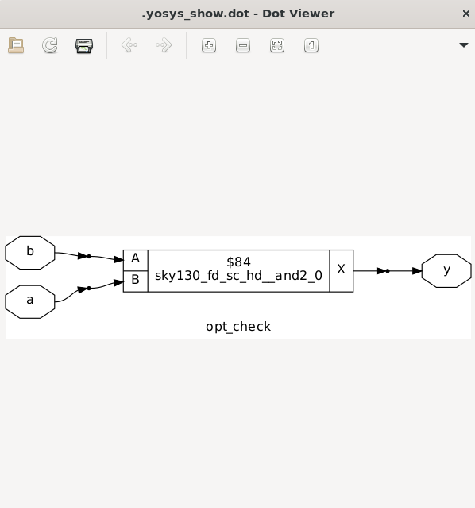
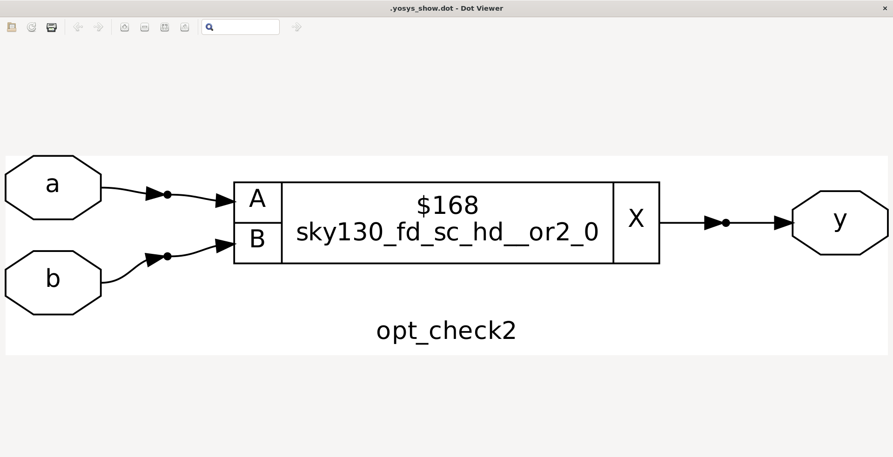
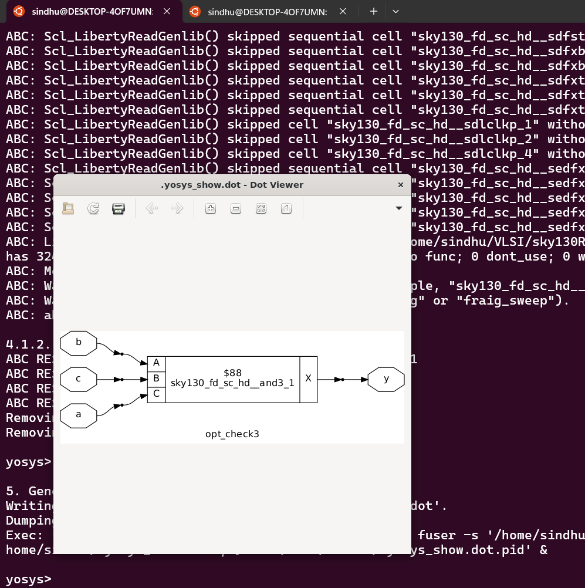
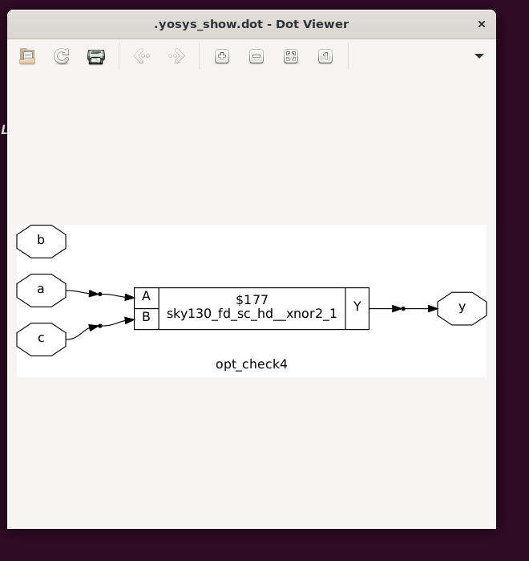
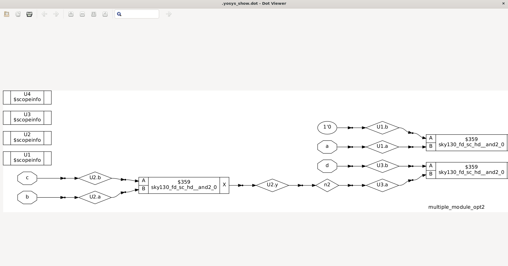

#  Day-3 – Optimization in Digital Logic


---

## ✨ What is Optimization?

Optimization in digital logic means **squeezing the logic to get a more efficient design** — reducing **area** and **power** without affecting functionality.
This improves performance and lowers manufacturing costs.

---

## 📌 Topic-1: Combinational Logic Optimization

### **Methods**

#### **1. Constant Propagation**

Example:

```
y = ((A·B) + C)'
```

If `A = 0`, it simplifies to:

```
y = C'
```


#### **2. Boolean Simplification**

Example:

```
y = a ? (b ? c : (c ? a : 0)) : (!c)
```

Simplifies to:

```
y = ~(a ^ c)
```

---

## 🧪 Lab Work — Combinational Logic Optimization

**Case 1:**

```verilog
module opt_check1(input a, input b, output y);
  assign y = a ? b : 0;
endmodule
```

Simplifies to:

```
y = a·b
```



---

**Case 2:**

```verilog
module opt_check2(input a, input b, output y);
  assign y = ~(a)·b + a;
endmodule
```

Simplifies to:

```
y = a + b
```



---

**Case 3:**

```verilog
module opt_check3(input a, input b, input c, output y);
  assign y = a ? (c ? b : 0) : 0;
endmodule
```

Simplifies to:

```
y = a·b·c
```



---

**Case 4:**

```verilog
module opt_check4(input a, input b, input c, output y);
  assign y = a ? (b ? (a & c) : c) : (!c);
endmodule
```

Simplifies to:

```
y = ~(a ^ c)

```



---

**Case 5 — Multiple module optimization:**

```verilog
module sub_module1(input a, input b, output y);
  assign y = a & b;
endmodule

module sub_module2(input a, input b, output y);
  assign y = a ^ b;
endmodule

module multiple_module_opt(input a, input b, input c, input d, output y);
  wire n1, n2, n3;

  sub_module1 U1(.a(a), .b(1'b1), .y(n1));
  sub_module2 U2(.a(n1), .b(1'b0), .y(n2));
  sub_module2 U3(.a(b), .b(d), .y(n3));

  assign y = c | (b & n1);
endmodule
```

Simplifies to:

```
y = c + a·b
```


---

**Case 6 — Multiple module optimization:**

```verilog
module sub_module(input a, input b, output y);
  assign y = a & b;
endmodule

module multiple_module_opt2(input a, input b, input c, input d, output y);
  wire n1, n2, n3;

  sub_module U1(.a(a), .b(1'b0), .y(n1));
  sub_module U2(.a(b), .b(c), .y(n2));
  sub_module U3(.a(n2), .b(d), .y(n3));
  sub_module U4(.a(n3), .b(n1), .y(y));
endmodule
```

Simplifies to:

```
y = 0
```



---

## 📜 Conclusion

Hence, in this way, **combinational circuits can be optimized**.
We observed that when synthesized, we get the optimized results we expected, with reduced logic depth, area, and power consumption.
