# Day-4 – Optimization in Sequential Logic


---

## ✨ What is Sequential Optimization?

Sequential optimization means **simplifying or restructuring circuits that have memory elements (like flip-flops, latches, FSMs)** while preserving the same functionality.
This reduces **area, power, and timing delay**, and also makes the design more floorplan-friendly.

---

## 📌 Methods

### **1. Constant Propagation**

* Example: a **D flip-flop** with input `D=0`, clock, and reset.
* The output `Q` goes into a NAND gate.

```
Q ───► NAND ───► y
```

* Since `D=0`, the FF always outputs a known value after reset → **`y=1` (constant)**.
* Optimization: This whole circuit can be replaced by a **constant `1`**.

⚠️ But if a **Set** pin is given, then `Q` could be `0` or `1`. Hence optimization is **not possible**.


---

### **2. State Optimization (Removing Unused States)**

* In **Finite State Machines (FSMs)**, sometimes states are defined but never reached in practice.
* These **unused states** can be removed safely.
* Example: An FSM with 6 states, but only 4 are reachable → optimize to a 4-state FSM.
* Benefits: smaller next-state logic, fewer flip-flops.


---

### **3. Retiming**

* Retiming is the process of **relocating flip-flops across combinational logic** to improve timing.
* Goal: balance the logic delay between stages → achieve higher clock frequency.
* Example:

```
Without Retiming:
FF → [Long Combinational Logic] → FF → [Short Logic] → FF
```

```
After Retiming:
FF → [Balanced Logic] → FF → [Balanced Logic] → FF
```

* Effect: reduces critical path delay while keeping input-output functionality intact.


---

### **4. Sequential Logic Cloning (Floorplan Aware)**

* When a **single flip-flop drives loads spread far apart** in layout, routing delay increases.
* **Cloning**: duplicate the flip-flop physically closer to its load regions.
* Each clone gets the same input, clock, and reset — but drives a **smaller fanout**.

Result:

* Better timing closure
* Lower wirelength and congestion


---

## 🧪 Lab Work – Sequential Logic Optimization


### **1. `dff_const1`**

```verilog
module dff_const1(input clk, input reset, output reg q);
always @(posedge clk, posedge reset)
begin
	if(reset)
		q <= 1'b0;
	else
		q <= 1'b1;
end
endmodule
```

**Explanation:**

* On reset → `q=0`.
* After first clock → `q=1` permanently.
* **Optimization:** Output is always 1, so DFF can be removed → `q=1`.

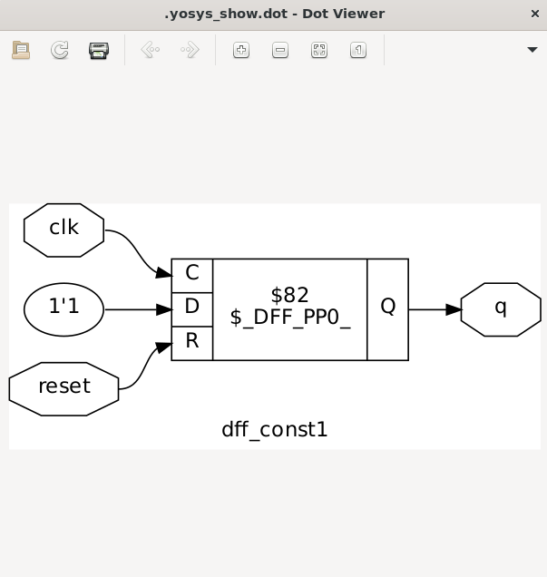

---

### **2. `dff_const2`**

```verilog
module dff_const2(input clk, input reset, output reg q);
always @(posedge clk, posedge reset)
begin
	if(reset)
		q <= 1'b1;
	else
		q <= 1'b1;
end
endmodule
```

**Explanation:**

* Reset or clock doesn’t matter, `q=1`.
* **Optimization:** Directly tie output to constant → `q=1`.
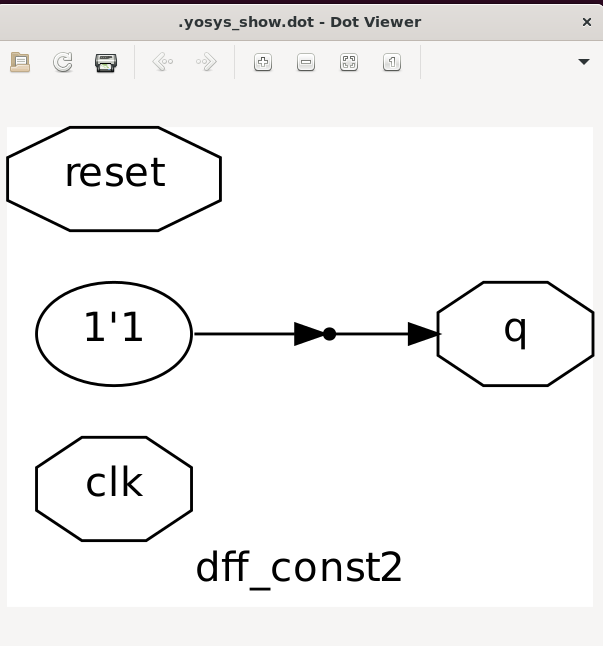
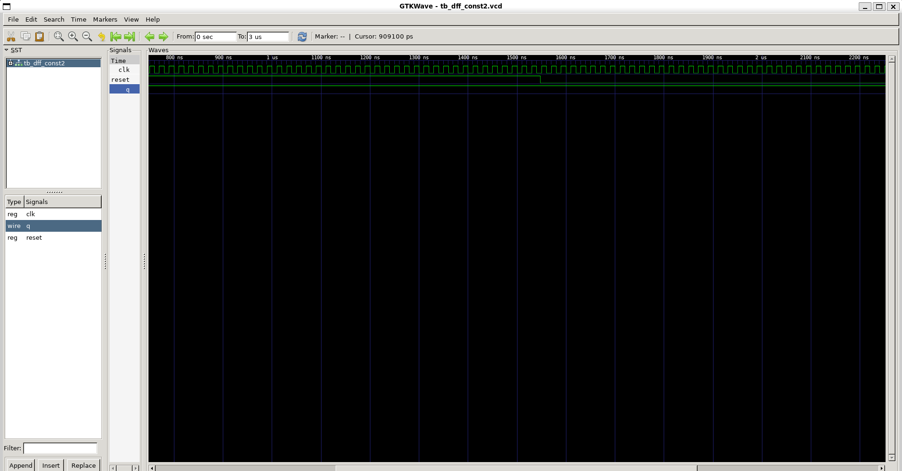

---

### **3. `dff_const3`**

```verilog
module dff_const3(input clk, input reset, output reg q);
reg q1;
always @(posedge clk, posedge reset)
begin
	if(reset)
	begin
		q <= 1'b1;
		q1 <= 1'b0;
	end
	else
	begin
		q1 <= 1'b1;
		q <= q1;
	end
end
endmodule
```

**Explanation:**

* Reset → `q=1, q1=0`.
* After 1 clock → `q=0`.
* After 2 clocks → `q=1` permanently.
* **Optimization:** Output settles to constant → `q=1`.
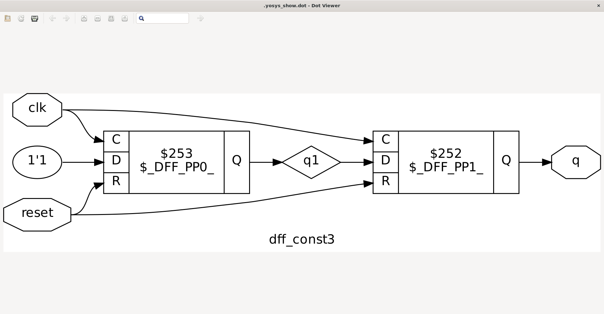
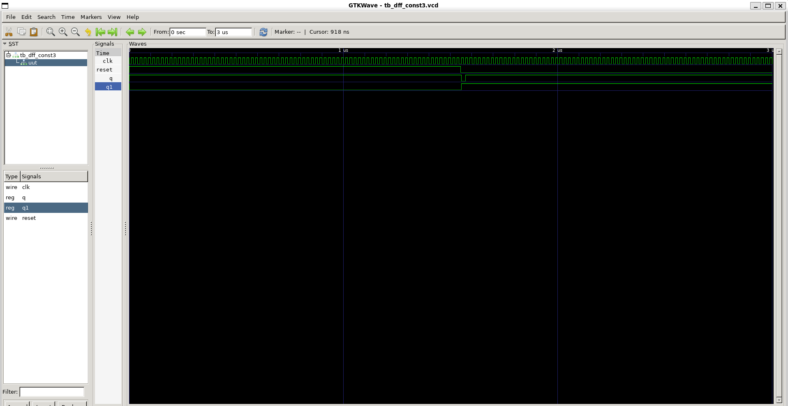
---

### **4. `dff_const4`**

```verilog
module dff_const4(input clk, input reset, output reg q);
reg q1;
always @(posedge clk, posedge reset)
begin
	if(reset)
	begin
		q <= 1'b1;
		q1 <= 1'b1;
	end
	else
	begin
		q1 <= 1'b1;
		q <= q1;
	end
end
endmodule
```

**Explanation:**

* Reset makes both `q` and `q1=1`.
* They always remain 1 afterwards.
* **Optimization:** Output is constant → `q=1`.
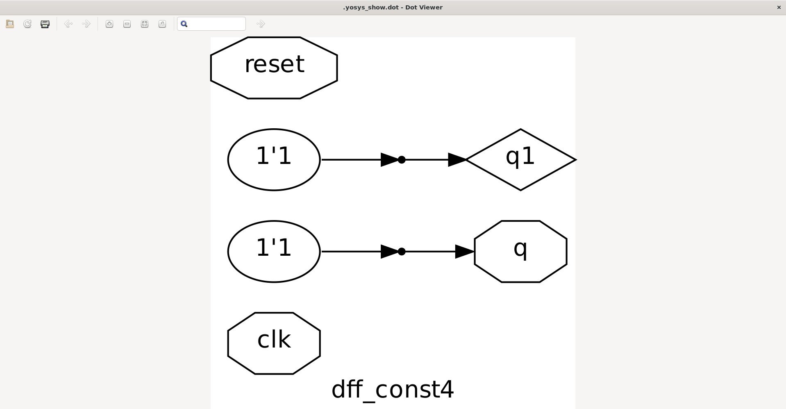


---

### **5. `dff_const5`**

```verilog
module dff_const5(input clk, input reset, output reg q);
reg q1;
always @(posedge clk, posedge reset)
begin
	if(reset)
	begin
		q <= 1'b0;
		q1 <= 1'b0;
	end
	else
	begin
		q1 <= 1'b1;
		q <= q1;
	end
end
endmodule
```

**Explanation:**

* Reset → `q=0`.
* After 1 clock → `q=0`.
* After 2 clocks → `q=1` permanently.
* **Optimization:** Eventually constant → `q=1`.
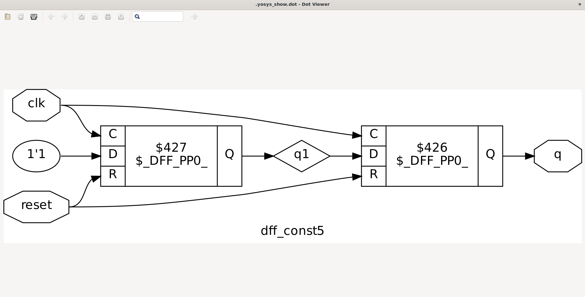
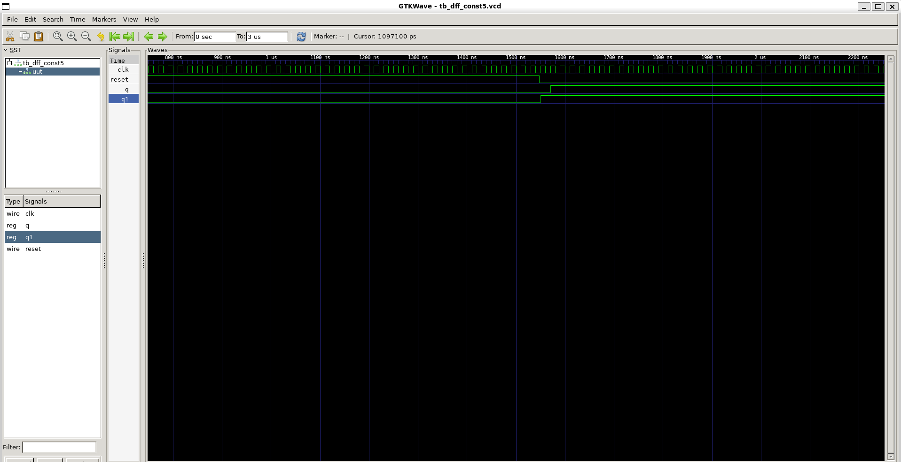

---

### **6. `counter_opt` (Case 1)**

```verilog
module counter_opt (input clk , input reset , output q);
reg [2:0] count;
assign q = count[0];
always @(posedge clk ,posedge reset)
begin
	if(reset)
		count <= 3'b000;
	else
		count <= count + 1;
end
endmodule
```

**Explanation:**

* `count` is 3-bit counter.
* Output `q` is just the LSB → toggles every clock.
* **Optimization:** No need for full 3-bit counter. Can be replaced by single toggle flip-flop.
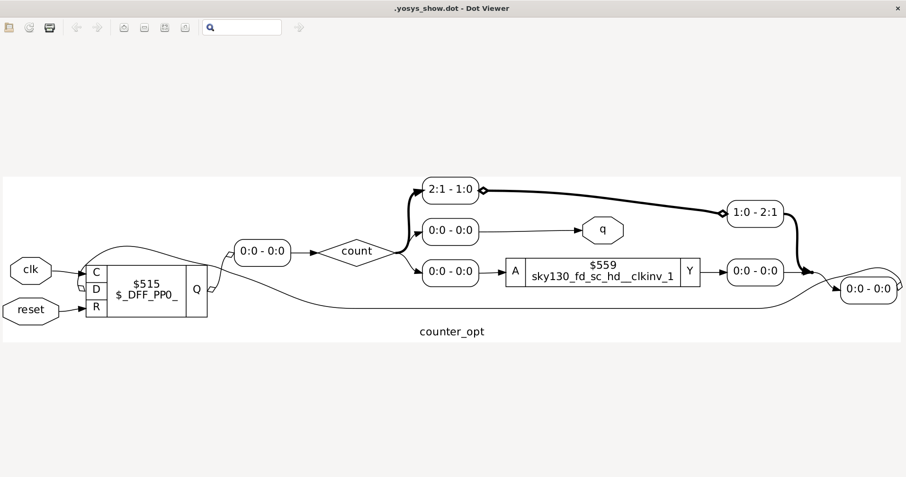


---

### **7. `counter_opt` (Case 2)**

```verilog
module counter_opt (input clk , input reset , output q);
reg [2:0] count;
assign q = (count[2:0] == 3'b100);
always @(posedge clk ,posedge reset)
begin
	if(reset)
		count <= 3'b000;
	else
		count <= count + 1;
end
endmodule
```

**Explanation:**

* `count` is 3-bit counter (0–7).
* Output `q=1` only when `count=4`.
* **Optimization:** Equivalent to counter + simple comparator. No full decoder required.


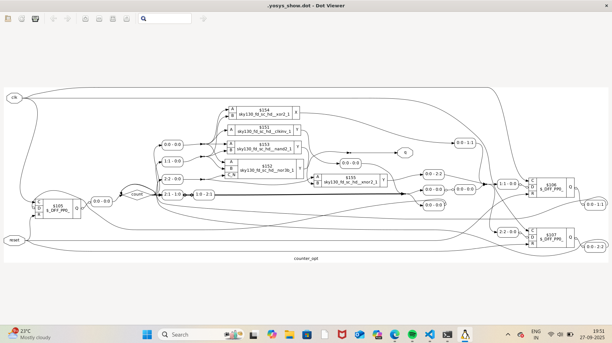
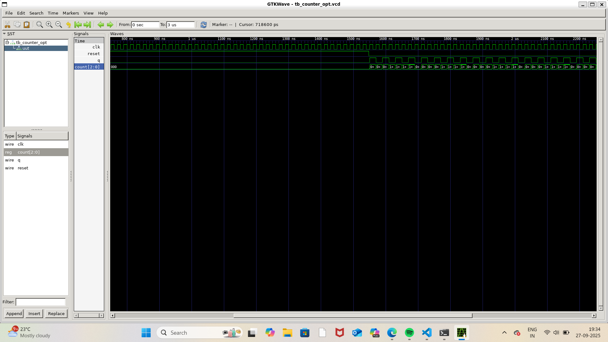